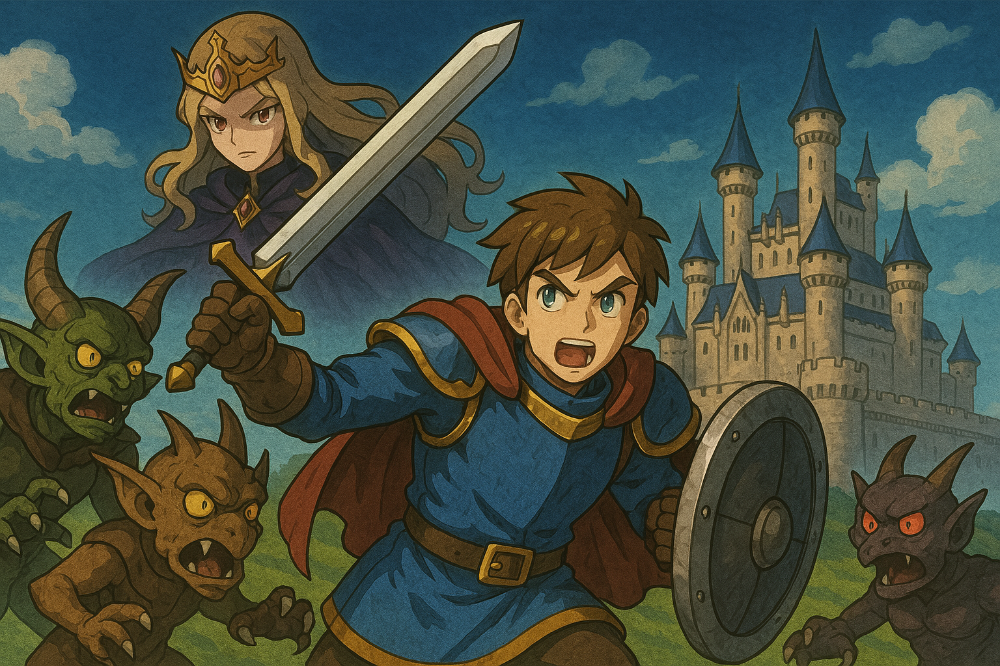

# 勇者鬥惡龍—王女之誓



## 一、勇者

雷夫加爾德的天空總是清澈明朗，仿佛連邪惡也只能在陰影中躲藏。

那天清晨，拉達托姆城門外，一位年輕的劍士走上階梯。他並不起眼——粗布衣、簡單的皮甲，背上背著一把已磨得發鈍的劍。他的目光堅定，腳步沉穩。他的名字無人知曉，只有王室中的幾位長者認得他那獨特的徽章——那是羅德之血的印記。

「是他嗎？」守衛悄聲問。

「嗯，沒錯。」王室神官答道，「命運之人來了。」

--

王宮大殿之中，老國王滿臉焦慮。

「勇者啊，請聽我懇求！」他顫聲說道，「龍王現身於西南方的黑暗城堡，召喚魔物侵襲我國。最可怕的是，他掠走了我的女兒——蘿拉公主！」

勇者靜靜點頭，未發一言。他只是在想，這位國王說的每個字都像在演戲。但他沒有說破。他接受了任務，也接受了國王給的三件物品：金幣、火把與魔法鑰匙。

--

於是，一場冒險展開了。

他穿過森林、跋涉山丘，與史萊姆搏鬥、與幽靈周旋。他學會了魔法，鍛鍊了劍技，也在一個沙漠洞窟中發現了那塊石碑——

「吾為羅德。若欲重現光明，當循吾之道，擊敗龍王。」

看著石碑的那一刻，勇者有些愣神。

「……誰會沒事寫這種話刻在石頭上？」

他笑了一聲，繼續前行。

--

某日，他終於在一座地底山洞中，發現了被魔物守護的牢房。那裡，有一位金髮少女身披破舊長裙，卻仍坐得端莊如初。她仰頭看著他，嘴角露出一絲像是早就知道他會來的笑容。

「你來得有點晚呢，勇者大人。」

她是蘿拉公主。

他沒有說話，只是將她背在背上，踏出黑暗。

--

王國歡欣鼓舞。百姓稱頌勇者，國王再三感謝，蘿拉則安靜地坐在王座旁，不再多言。

接下來，還有最後的戰鬥。他知道他終將面對龍王，終將走進那座佈滿火焰的城堡。

而他不知道的是——

從一開始，他就從未真正做過選擇。

## 二、她的王國

城堡的夜晚一如往常，寧靜得幾近虛假。

高塔頂端的房間裡，蘿拉靜靜坐著，窗外風聲拂過，像是低語的亡魂。她手中沒有繡花針，也沒有詩冊。她正在看一張地圖——親手描繪、標註、調整過無數次的地圖。

那是亞雷夫加爾德，但不是國王眼中的那個國度。

她的地圖上，畫著暗道、補給線、村莊糧倉的潛在動員能力。她知道各地怪物的出沒路徑，甚至知道那塊沙漠洞窟中石碑的內容——因為她寫的。用古語，刻在幾年前的冬天。

她曾經天真地以為自己會嫁給一位騎著白馬的王子，直到她發現，每一個來提親的貴族子弟都只看她的血統、她的嫁妝、她父親的王位。

從那天起，她不再等王子。

她決定寫下自己的故事。

--

她召來過去羅德王朝遺留下的密使、魔法師、甚至禁咒學者，花費數年時間建構出「龍王計畫」。從幻術製作的魔王城，到控制魔物行動的禁咒，再到石碑與傳說碎片的散佈——這不是逃亡，而是設局。

蘿拉選擇自己成為囚徒，因為沒有什麼比被拯救的少女更能激起一位勇者的使命感。

那位勇者，她早已透過預言與占卜找到了。他的名字不重要，重要的是他的血統與性格——夠純粹、夠堅定、夠無知。

只要引導得當，就會成為她的理想對象。

--

他來了。

比她預期晚了三個月，但還是來了。她第一次見到他時，是透過水鏡魔法。他狼狽地從史萊姆手中逃命，然後跌坐在林邊的草地上，氣喘如牛。

她微微一笑：「很好，他還會害怕。還沒失去人性。」

那天晚上，她親自走進了魔王城，調整了一道陷阱的機制——讓它變得稍微容易一點。

她不想他死太快。

--

再一次，她坐在牢房裡，等待他的腳步聲從地道深處響起。當她聽到那熟悉的金屬碰撞聲時，她知道——他來了。

她收起思緒，換上那個「被囚困的公主」的表情與語氣。眼神中藏起了計算，語調裡放進了一絲柔情。

「你來得有點晚呢，勇者大人。」

她讓他背著她離開，像是依賴、像是信任、像是愛情的起點——但那不過是下一階段的考驗。

--

在拉達托姆城的日子裡，她幾乎不說話。

她在等，看他會不會主動向國王索要賞賜、向她提親、或是乾脆定居享受榮耀。

但他沒有。他只是在房間裡研磨劍刃，默默地練習火球術。她在他身上看見了什麼？

不順著劇本走的意志。

她微微點頭。再等最後一步。

--

幾天後，他將踏上前往魔王城的旅程。她知道，真正的對決不在那裡。魔王不過是一具她用禁咒捏出的龍型幻獸，會說話、會提出選擇，但不會有靈魂。

真正的選擇，會在結束後。

當王對他說：「把王國給你」時，他會怎麼回答？

會說「謝謝」然後留下？會說「我想環遊世界」？還是——轉身看她一眼？

那一眼，才是真正的勝利條件。

--

她不是在等人來救她。

她是在等人值得她一同離開。

## 三、王的心聲

拉達托姆的王座並不舒適。這是老國王在年過半百後才明白的事。

那是一張鑄鐵骨架、鑲金飾邊的王椅，曾經象徵著羅德王朝的榮光。坐上去的那天，他才三十歲，滿臉英氣，萬人擁戴。但幾十年過去，他的脊骨早已承受不起那股象徵性威嚴的重量。

他的王國，也開始裂縫叢生。

—

龍王出現，是意外嗎？

他其實不太確定。那些村莊傳來的報告，時常混雜著謠言與迷信。有的說夜裡聽到龍嘶，有的說水源被詛咒了，有的說看到魔物在田裡跳舞。

真正的消息，是從他女兒蘿拉失蹤那天開始的。

那天早晨，他推開她的房門，看到的是一張整齊的床鋪，窗戶微開，陽光靜靜落在空無一人的室內。

他當下的反應不是驚恐，而是……一股說不出口的不安。

他第一時間就知道，這不像是被綁架。

蘿拉從小就是聰慧過人的孩子。她不吵不鬧，也從不任性，但那種沉靜裡，藏著某種可怕的決意。

—

他當然對外宣稱她被龍王掠走了。這是一個統治者該說的話。要是他說：「我的女兒不見了，我不知道她去哪了」——他還怎麼統治？

而更神奇的是，那之後，真有「魔物潮」開始出現。森林變得危險，旅人失蹤的頻率上升，連王都附近都開始出現史萊姆。

他也開始相信，也許……真的有龍王。

但他內心一直有個聲音在問：

「這一切來得太剛好，不是嗎？」

—

勇者出現時，他看著那位少年，心中複雜至極。

他看起來並不特別，只是個農家子弟模樣的小子。但在他踏入王殿時，有那麼一瞬間，蘿拉的面容從他腦中閃過。

她曾經說過——「如果這世界不能讓人選擇命運，那就毀了它也罷。」

當時他只是笑笑，覺得那只是少女的詩意幻想。但現在，他不那麼確定了。

—

蘿拉被「救回來」的那天，她靜靜地站在他面前，臉色蒼白、衣裳破舊，卻毫無驚懼或羞辱的神色。

她看著他的眼神，冷得像冬日冰湖。

他一度想說些什麼——「你受苦了」、「父王擔心你」——但什麼也沒說出口。他突然發現自己在一個王的身分下，無法對自己的女兒說一句誠實的話。

—

現在，勇者要前往魔王的城堡了。

他坐在王座上，看著那年輕人走出王宮，心中有一絲釋然，更多的是……畏懼。

「如果連這孩子也只是她計畫中的一環……那麼，她到底想做什麼？」

他開始明白，自己早已不是故事的中心。

他的權力，只剩象徵。

他的女兒，早就不是那個乖巧聽話的女孩。

他甚至懷疑——等勇者歸來的那一天，到底是誰會坐上這座王座？

—

國王仰望王座上方的掛毯，那上頭繡著羅德的徽章與古老的箴言：

「光之血將照耀黑暗。」

但他心中卻升起另一句尚未有人敢說出口的話：

「那光啊……是不是也能把國王燒成灰燼呢？」

## 四：路在何方？

他沒有名字。

也許他小時候有，但村裡人早就習慣叫他「那個孩子」、「你家那個小的」、「嘿，喂」。他也就不再糾正。

他是母親跟旅人所生的孩子，沒有姓，也沒有繼承物。母親在他十歲那年病死，村裡人看在眼裡、冷著心，給他留下了一個廢棄的牧羊棚讓他躲雨，然後——就再也沒人管他了。

—

十七歲那年春天，他幫村東頭的磨坊修了一根輪軸，領了幾個銅幣。傍晚他坐在河邊，看著水流，想著接下來要去哪。

他不是沒想過離開，但去哪？幹什麼？

就在這時，他看到一隻史萊姆從河對岸的草叢裡彈了出來，像果凍一樣顫顫巍巍地跳進了水裡。

他愣住。那是他第一次看到魔物。

更奇怪的是，它根本沒有攻擊性，只是在那邊亂跳。像是……像是某種表演。

那一刻他不知道為什麼，心裡忽然升起一股莫名其妙的怒氣。

他撿起身邊的木棍，踏進水裡，一棍把那史萊姆打翻在石頭上。血色暈開，但他沒覺得興奮，也沒覺得悲傷。

他只是低頭，看著自己握著木棍的手。第一次，那手不是為了別人工作，也不是為了填飽肚子。他用它做了一件沒有任何人要他去做的事。

那感覺……自由得像一場夢。

—

隔天他離開村子，什麼也沒說。身上只帶了一塊麵包、一把母親留下的小刀，和一塊從磨坊後院撿來的舊盾。

他不知道世界的盡頭在哪，也不知道該去哪裡。但他知道，只要手裡拿著劍、腳下有路，他就還能前進。

他沒想過會有人等他。

更沒想過，會有人在他出發之前，早就為他安排好了一切。

他只知道，在那遙遠的國度，有一座城，名字叫——拉達托姆。

—

他不是為了王國出發的。不是為了公主，不是為了命運。

只是那天，他終於想明白：

「如果不走出這一步，我這一生就是個無名小鬼。哪怕死在路上……也總比坐著被遺忘好。」

## 五、王的交付

王宮的大殿如常地靜謐。紅毯筆直地通往王座，兩側守衛如石像般沉默。

國王坐在高台之上，鬍鬚斑白，神情莊嚴。他雙眼微微下垂，注視著那名剛從遠方踏進大殿的少年。

——就是這個孩子了。

他看起來還不成熟，身上只穿著獵人服改造的皮甲，腰間那把劍也像是撿來的。他沒有光環，沒有貴族氣息，甚至沒帶上一句自我介紹。

但他眼中有火。那種王見過的火——失去一切的人才有的火。

—

王深吸一口氣，朗聲開口，語調與以往一模一樣，像是早已排練好的古老台詞：

「勇者啊，你終於來了。亞雷夫加爾德陷入黑暗，龍王自西南而來，劫走了我的女兒，蘿拉……我請求你，解救我國，解救我的子民。」

少年沒有說話，只是點頭。

國王頓了片刻，轉頭示意侍從拿出備好的物品。

他心裡很清楚，這三樣東西不是他準備的。

—

第一樣，金幣。

沉甸甸的布袋，裡面是一百枚金幣，足夠一名旅人購置裝備，渡過頭幾週的荒野。

國王將它交到少年手上，微微一怔。那年他還是王子時，父王也曾這樣把金袋交給一名騎士。那位騎士死在山脈，屍首找不回來。

「小心用它，別買太多你用不到的東西。」

—

第二樣，火把。

一根黑橡木枝，上頭繞著油布。點燃後能燃燒數小時，足以照亮洞窟深處的通道。

「別讓黑暗吞噬你。」他說。

他不知道自己為何說出這句話，卻覺得它極其重要。彷彿不是對這少年說，而是對一個即將沉入命運迷宮的人低聲提醒。

—

第三樣，魔法鑰匙。

通體銀色，小巧精緻，柄上刻有古老的語言，據說能打開拉達托姆古堡中那些「不該開啟」的門。

國王將它遞出時，手微微發抖。

「這鑰匙……你會知道什麼時候該用。」

他不敢再多說。

因為他忽然意識到，那些門後的不是秘密，而是真相。

—

少年接過三樣東西，深深一鞠躬。

他轉身離開，腳步無聲無息。整個過程乾脆利落，像是早已練習多次。

國王靜靜坐在王座上，心中卻有個聲音，正在滴水穿石般地響著：

「這三樣東西，不是我給他的。是誰，透過我，把劇本塞進了我手裡？」

他感到一絲顫抖，像是自己成為了某個更大意志的傀儡。
一位國王，卻無法選擇要不要發出召喚。

—

當少年離開殿門時，國王不自覺回頭看向高塔方向。

那裡，有扇窗微微敞開。窗後的那個人，正靜靜地看著這一切。

她的眼神淡然、冷靜、毫無波瀾。
彷彿早就知道結果會是這樣。

## 六、旅程

他已經記不清自己殺了幾隻史萊姆了。

剛開始還會小心翼翼地躲開、觀察、出手。後來，只剩下下意識的揮劍，聽見聲響就反射式斬下去。像是在執行某種他不懂但又不得不完成的機械儀式。

這就是「成長」嗎？

他曾幻想成為英雄會是什麼模樣。人們喝采、旗幟飄揚、胸前佩著勳章。但一路走來，他只看到死寂的村莊、燃燒過的麥田、還有一張張疲憊到說不出話的臉。

每當他走進一家旅店，老闆娘的眼神裡都是疑懼——你是來殺怪的？還是會招來怪的？

—

他手上的裝備越來越好。羅德之劍、羅德之鎧，他一件件從地底挖出、從怪物手中奪回。那些寶物光芒萬丈、歷史悠久——但沉重得不像屬於人類的東西。

每次穿上羅德的鎧甲，他都覺得那不是庇護，而是負擔。
像是在穿上一段傳說的重量，而不是一件保命的工具。

—

還記得那塊石碑。

「吾為羅德。若欲重現光明，當循吾之道，擊敗龍王。」

他當時愣了很久。不是因為感動，而是……疑惑。

為什麼？為什麼是他？為什麼這塊石碑寫得像是知道他會來一樣？

那句話像是一道命令，卻又像是一張劇本的台詞。

—

他也曾思考要不要放棄。有幾次，他真的快死了。怪物太強、藥草不夠，甚至在山谷裡差點被毒蛇咬死。每次他倒下的時候，他都覺得這樣就結束了也好。

可偏偏，每次都有人、或某種力量把他「剛好」救回來。

像是——不能死。像是——這場戲還沒演完。

他有一瞬間懷疑自己是不是某種被操縱的玩偶。
但當他看到蘿拉的那雙眼睛，他又迷惑了。

她不是求助的樣子。
她不是等待的樣子。

她只是看著他，像是在看一場她早就知道結局的棋局。

那時他第一次有個念頭：也許這一切，不是我來救她。是她讓我走到這裡的。

—

夜裡他躺在旅店的床上，聽著牆後有人輕聲說夢話。

他忽然想問——

「這世界，真的需要被拯救嗎？還是……只是有人想證明自己有能力支配它？」

他握著劍，閉上眼。

他知道他會繼續往前走。

不是因為他相信這世界值得拯救，而是因為——

「我走到這裡了，就不能停下來。」

## 七、第一次死亡

山脈北側，風雪剛停。天空像被揉皺的羊皮紙，一層層灰白捲動。

他跌倒時，其實沒什麼劇烈的感覺。那是三隻鐵甲獸突襲時留下的傷口——深至骨頭。劍掉在地上，他連伸手去撿的力氣都沒有。

血在岩地上漸漸攤開，染紅了一顆被踩碎的藥草。

他想說些什麼，但喉頭只擠出一點氣音。他知道自己沒辦法再站起來了。

「原來我是會死的啊……」

他第一次這麼真切地感覺到終點。不是在城裡旅館醒來、不是負傷逃脫，而是——身體真的要崩解了。

天空開始旋轉，眼前逐漸發黑。

—

接著，他睜開眼睛。

—

王城的天花板一如往常地乾淨。
他躺在柔軟的床上，身上乾乾淨淨、劍整齊地靠在牆邊，連那塊染血的布料都換成新的。

身旁，一位神官微笑著看他。

「你回來了，勇者大人。神明與人民都在祝福著你。」

他沒有說話，只是慢慢坐起來，看著自己的雙手。

沒傷痕。

他伸手摸了摸自己的胸口——那裡應該有一刀橫穿的裂口，現在只剩下一層完美的皮膚。

太完美了。
不像復原，更像是——複製。

—

他穿好裝備，一言不發地走出房間。
沿路的士兵與宮女依舊用敬畏的眼神看他。

「又成功打倒魔物了嗎？」
「這才是羅德的後裔呢。」

他沒有回應。他感到某種說不出的虛假正在覆蓋整個世界。

他走進城裡最角落的倉庫，打開一個又一個櫃子。不是為了找寶物，而是為了確認——是不是每一次他回來，這些東西也會「剛剛好」回到原位。

他找到了相同位置的藥草、相同數量的金幣、甚至連某個櫃子上的灰塵都和上次一樣。

這不是世界。
這是舞台。

—

他坐在城牆上，望著夕陽，終於吐出一句話：

「我不是被救了，我是被重啟了。」

風拂過他臉頰。他忽然笑了一下，那不是輕鬆的笑，而是一種絕望裡的幽默感。

「這樣啊……原來就連死……也不讓我自己決定嗎？」

他忽然明白，這世界對他最大的限制不是怪物、不是迷宮、甚至不是龍王——

是那雙看不見的手。

讓他不能真正結束，也不能真正選擇。

—

那晚，他沒有睡。
他只是靜靜地坐著，劍橫在膝上，盯著那扇塔樓的窗戶——

那裡，夜裡依舊有燈火搖曳。
他不知道蘿拉是不是還醒著。

## 八、箱中之物

他不知道自己是從什麼時候開始，無法控制地翻找箱子、櫃子、罐子。

一開始，只是為了找點補品。他口袋空空，打死一隻史萊姆也只掉一塊銅幣。他記得他翻開過一個農舍角落的陶罐，裡面竟然有塊藥草。他當時笑了出來，像是第一次發現這個世界也會回報自己。

但後來，那變了。

—

某個村莊，他無意間翻開一個不起眼的箱子，裡面竟然有封信。泛黃的紙張寫著：

「他說他會回來，但已經過了三年。我不敢再相信神了。」

信沒有署名。他看完之後沒有帶走，只是把箱子慢慢闔上。

那天晚上他睡不著。他忽然想到：如果這些箱子裡放的不只是道具，而是——這個世界曾經有過的記憶呢？

—

於是他開始翻。

每到一個新村莊，他不跟村民對話、不買裝備，第一件事就是繞進後院，進屋裡找箱子、櫃子、桶子。他曾經在一個麵包店後廚的櫃子裡，翻到一封遺書；在一口井底下的石槽裡，找到一枚生鏽的戒指；甚至還在一棟破屋裡，翻出一張畫著「龍王城地圖」的塗鴉。

這些東西，沒人提起過，沒人記得。
但它們就那樣存在著。

—

他開始覺得，這世界的「真相」並不在人與人之間，而是在這些被遺忘的小角落裡。

「如果這世界是舞台，那這些箱子……也許就是道具組忘了撤下的痕跡。」

那一刻，他甚至覺得興奮。
每一個被打開的箱子，都像是用刀片在世界邊緣劃開一道裂縫。

—

但也有一次，他打開一個村民的儲物櫃，裡面空無一物。

他心裡莫名涌出一股焦躁感。他打開第二個、第三個、第四個……通通空空如也。

「……她發現了嗎？」

那天他沒有睡。他抱著劍躲在旅店的床底，直到天亮。

他開始發現，不是所有的箱子都一直有東西。有些地方，在他來過之後，不再留下任何痕跡。

像是有人——正在收走他能找到的真相。

—

自此之後，他翻箱子的動作變得急促、焦躁、有點像強迫症。他無法控制自己。他甚至在一次緊急逃命中為了翻一個櫃子被毒蛇咬傷。

他已經不再在乎裡面有沒有藥草、錢幣、武器。

他只想知道，這個世界是不是真的有人在寫劇本，然後又試圖擦掉它。

—

他從未對任何人說起這些行為。
但他知道，她在看。

每一次他翻箱子時，某種視線就會從遠處傳來。

不帶敵意，也不帶責備。

只是一種觀察。

就像研究者在看一隻老鼠——牠什麼時候會發現牆上有洞。

## 九、誰能死？

那是一間沒人知道的祕密房間。

他是在一次無目的的翻箱行為中發現那道門的——藏在王城西塔的樓梯後，一道原本應該「無法打開」的牆，忽然鬆動了。

也許是他的等級到了，也許是……她準備好了。

—

房間裡光線昏黃，石牆覆滿古老的詩文。他坐在中央一張長凳上，對面坐著她——

蘿拉。

她穿著常見的白色長袍，沒有王族徽飾，也沒有侍從陪伴。只是靜靜看著他，如同從那天在地牢被救出來後一直以來的那種眼神——

不驚、不懼、也不感激。

他開口。

「我想問妳一件事。」

她點頭。

「如果這個世界的人死了都能復活……那為什麼是我？為什麼不是別人來救妳？」

蘿拉沒回答，只是輕輕偏頭，像是在思考。

他咬緊牙關，繼續說：

「我不是什麼天選之人，我也不是你父王的將軍。我只是個從沒人記得的小鬼——但我卻一再醒來，一再被送回這個舞台。妳說，這是神的旨意？還是妳的計劃？」

沉默了一會兒，蘿拉低聲開口：

「我沒讓任何人復活。我只讓你復活。」

—

他怔住。

她的語氣沒有起伏，像是在陳述一個天氣現象。

他忽然覺得空氣冷得刺骨。

她繼續說：

「我只設定了一個人——一個，會一直走到最後的人。不是最強，也不是最勇敢，而是最空的人。沒有過去，沒有牽掛，也沒有選擇。這樣的人，不會停下來。」

他忽然覺得噁心。他想到那些他殺過的怪物——哥布林、石像鬼、骷髏兵。他以為自己是在戰鬥、在拯救世界。

「那我殺的那些魔物呢？他們真的死了嗎？還是他們也會像我一樣，回到某個地方，被妳重新召喚出來？」

蘿拉看著他，眼神沒有波動。

「那不是你該擔心的事。」

—

他站起來，怒氣開始滲出喉嚨。

「那我呢？我到底是什麼？一把劍？一隻棋子？還是你拿來測試世界的工具？」

她站起來，走近他一步，眼神仍然冷靜，卻多了一絲……哀憐？

「你當然不是工具。你是答案。」

「我創造了這場局，是為了找到能走完它的那個人——唯一一個，能走到這裡，並且問我這些問題的人。」

—

他沉默了。像是剛被世界狠狠扇了一巴掌。

他終於懂了。

他之所以活下來，不是因為被神選中，而是因為她一直讓他活下來。

這不是恩賜，這是測試環境裡的保護機制。

一個模擬中的失敗者，每次被重置後再放進實驗室。

而她，是觀察者，是創造者，是……命運。

—

蘿拉走回原位，坐下，雙手交疊。

「你可以繼續往前，也可以現在放棄。我會記錄下你的一切。直到找到更好的人——或你成為那個人。」

他轉身，走出房間。

身後那道門在他離開後靜靜關上，仿佛從不存在。

## 十、數值

他從來沒注意過自己的「力量值」。

直到那一天，他擊倒一頭石像鬼，看著它倒下時——他忽然聽見自己腦中浮現一串數字。

「力 +1」

那不是誰說的話，也不是什麼畫面提示。
只是像呼吸、像心跳那樣自然地出現在腦裡。

—

他站在原地愣了很久。

那不是第一次有人說他「變強了」。
但那一次，他真真切切地感覺到：

不是他在變強，是數字在往上加。

他低頭看著自己的手。他試著握拳、舉起劍、跳起來。他發現一件事：

每一個動作，都有一個「回饋」。
像是一個系統，在即時分析他的輸出與反應。

他能感覺到自己的速度值、負重值、魔力恢復速度。
那不是感覺，而是變成數據的「直覺」。

—

他開始回想這段旅程。

他吃下藥草時，能精準知道自己恢復了多少；

他穿上羅德之鎧後，能明確知道自己防禦上升了幾點；

甚至他對著怪物揮劍時，會不自覺預測出「應該還剩幾滴血」。

他不是人。他是一個數值模組的運算終端。

—

他曾經以為自己在變得堅強。

但現在他發現，他的「堅強」不是來自意志，也不是來自經歷，而是：

「你目前等級為 22，擁有 87 力量點，HP 153/153。」

不是「我很痛苦地打贏了」，而是「系統判定我通過了關卡」。

—

那晚他照著水面，發現一件更可怕的事。

他的臉，居然記不得細節。

他盯著水中的自己看了很久，但無論怎麼看，總是覺得那只是某個「標準臉」。五官合理、年紀模糊、表情模糊。

「這不是我的臉，這只是角色建立畫面裡選擇的模板。」

他雙手顫抖，額頭冒汗。他想著：

「如果我只是個參數集合……那我說過的話，是不是也只是預設選項？」

—

更可怕的是，他感覺到「被看見」。

他曾以為只有蘿拉在看他。但現在，他開始懷疑：

「不只她。還有更多人。」

他有時會感到一股壓力，像是數十雙眼睛、冷冷地、安靜地、從遠方觀察他的一舉一動。

不是關心，不是引導，是——

評估。

「你走得夠快嗎？」

「你這場戰鬥有沒有浪費回合？」

「你有沒有錯過寶箱？走了不該走的路？」

這些視線不說話，但他感覺得到。

他甚至有一刻懷疑，他所做的每一個選擇，都是一個分支的紀錄。
像是什麼人在做筆記，在標示這段冒險是否符合「最佳路線」。

—

他抱頭，蹲在草地上，像是要把這些聲音從腦子裡趕出去。

「我不是數值……我不是代碼……我是我啊……」

但當他哭出聲音的那一刻，他忽然在腦中聽見一行字：

「情緒狀態 + 焦躁；忠誠度 -1」

他全身僵住。
這句話不是他想的，不是誰對他說的。那就是一個世界的回應。

像是……這個世界真的在監控他的一切。

—

那一夜，他沒有休息。
因為他終於意識到：

「只要我還活著，我就還在被觀察。
只要我還在這個世界，我就不是自由的人。」

他抬頭看向遠方——那座燃燒著火焰的黑暗高塔。

也許那裡不會有答案。
但他知道：

「如果這世界真的有人在玩我，那我就要親手拔掉那個人寫好的結局。」

## 十一、魔王之城

在接近魔王城的前一天夜裡，他一個人坐在高地上，看著遠方那座燃燒著紅光的黑塔。

那塔高得幾乎接近雲端，彷彿是從地獄中生長出來的利刃。

但他心中升起的，卻不是恐懼——而是疑惑。

「為什麼他一直等著我過去？」

如果龍王真如傳說所說那般強大，那麼早該派軍壓境，掃平王國。他曾翻過被燒毀的村落、也看過荒廢的哨站，但從沒看見「龍王軍」的真正攻勢。

魔物到處出沒沒錯，但沒有戰略，沒有進軍路線。就像——

「就像他只是在派些怪物來磨練我。」

他把這想法壓下。也許只是他想太多。
但第二天，當他踏進魔王城的那一刻，這種不對勁的感覺再度升起。

—

城裡出奇安靜。

沒有巡邏的守衛，沒有伏擊的刺客，只有零星幾隻怪物，在看見他時甚至會讓路。

走廊兩側仍有寶箱。他像習慣般去翻開——裡面依舊有藥草、金幣，甚至還有一卷傳說中失落的古代咒文。

他皺眉。

「這裡，是敵人的心臟啊……為什麼我還能翻箱倒櫃？」

「這些寶箱，是誰放在這裡給我翻的？」

他忽然覺得，自己像是走在一條鋪好紅毯的路上。敵人不是抵抗他，而是等待他——像是在迎接什麼儀式的完成。

而他不是闖入者，而是——參加者。

—

更奇怪的是，沒有人來追殺他。

他翻過多少魔王城的密室、打開多少房門？如果這是戰爭，早該有防衛；如果這是禁地，早該有人警戒。

但什麼都沒有。

他有一瞬間想停下腳步，但他的雙腳卻自動繼續向前。

「是我選擇走進來的，還是——我被安排走進來的？」

那一刻，他第一次感覺到背後有雙眼睛在看他。

但他轉頭，什麼也看不見。

只有那條長長的石階，延伸向王座室的盡頭。

—

通往魔王城的橋，如一把通紅的鐵劍，穿過地獄般的赤焰河流。

勇者站在橋頭，深吸一口氣，然後邁出一步。

他沒有想太多。他知道這是一場終局之戰，從踏出拉達托姆那天起，這條路就是通向這裡。

但他內心有一點奇怪的安靜。像是在走入一齣已經彩排過無數次的舞台。

—

魔王城的空氣比地表更濃稠，每踏一步，都像是在泥中拔腿。
石牆滲出紅光，魔物出現得越來越稀疏，像是全都被什麼命令召回。

越是接近中心，越像被「預留」。

—

他推開最後的大門。

王座室空曠如墓地。燃燒的火盆沿著長廊排列，火光映在黑曜石地板上，像血在流。

寶座上坐著那頭龍。

不需要介紹，不需要敘述。他就是龍王。

身披漆黑的鱗甲，眼神如兩枚燃燒的戒指。

他開口，聲音低沉如地底震動：

「勇者啊……你終於來了。」

勇者緊握劍柄，不發一語。

「一路上你見過我軍的力量。也看過這個腐敗王國的虛偽。他們的王，躲在高塔裡；他們的軍，早已潰散。你一人對抗我，為了什麼？」

勇者開口，聲音帶著喘息：

「這是我該走的路。」

「誰告訴你該走這條路？」

這句話像刺針。他的呼吸一滯。

但龍王沒有追問，只是站起身，揮爪直取。

—

戰鬥爆發。

火焰、雷鳴、咆哮、劍光在王座室中炸裂。
地面被利爪撕裂，牆壁被魔法灼焦。勇者一次又一次被擊退、又一次衝上去。
他的鎧甲碎裂、肩膀流血、雙手顫抖，但他始終沒有倒下。

這不只是為了王國，也不只是為了公主。
他自己也說不上來——只知道，他必須戰到最後。

—

終於，龍王跪倒，身上的鱗片碎裂如破瓦。

他低聲咳笑，氣息如同末日風聲：

「你，確實是傳說中最強的勇者……」

他伸出一爪，指向黑曜石地面，火光中浮現一張巨大的地圖——整個亞雷夫加爾德。

「與我聯手吧。我分你一半的世界。」

—

那一刻，時間彷彿停止。

不是因為魔法，也不是因為震撼。

而是那句話——聽起來太像某種早已準備好的台詞。

勇者的腦中閃過一個念頭：

「這句話……像是在等我聽見。」

接著，腦海中響起一個聲音，冷靜而機械：

```
【你是否願意與魔王一同統治世界？】
→ 是
→ 否
```

他怔住了。

這不是第一次他聽見「選項」。一路上無數選擇，但這次，它太清晰了，清晰得像是某個人正在觀察他的反應。

他沒有選。

他只是看著龍王，握緊了劍，低聲問：

「……如果我說『是』，你會怎麼做？」

龍王微笑：

「你將與我一同分享支配。亞雷夫加爾德將成為我們的王國。沒有人再敢違抗你，也沒有人再命令你。」

那聽起來很合理。也很誘惑。
但某個聲音在他心裡悄悄響起：

「這是自由？還是只是另一個劇情分支？」

—

他最終舉起劍，指向龍王。

「我不信你。也不信這個世界給我的選項。」

龍王咆哮而起，身形暴漲，化為真正的巨龍！

火焰再次吞沒整個王座室。

勇者衝上前。

這一次，沒有選項。

只有——戰鬥。

## 十二、勝利

魔王倒下的瞬間，整座城陷入寂靜。

沒有爆炸，沒有崩塌，沒有震動。

只有一具龐大的龍骨，靜靜倒在王座前。火焰熄滅，黑石不再滾燙。像是一場舞台劇結束，所有道具都被拉回幕後。

勇者跪坐在地上，汗水和血混著滴落石板。

他以為會有什麼劇烈的情緒——狂喜、釋放、痛哭，什麼都好。

但——什麼都沒有。

他只感到一種巨大的空虛。

像是爬上山頂後發現山其實是中空的，或者打開寶箱發現裡面什麼都沒放。

—

他坐在魔王的屍體旁，等了很久。

沒有新的敵人出現，也沒有任何聲音。
彷彿全世界都在等他下一個動作。

他慢慢地站起來，抬頭看著天花板上那幅浮雕——太陽、劍、勇者、王座。

「所以……就這樣？」

他低聲問。但沒人回答。

—

他走出魔王城，站在高塔頂端，望著遠方的山與河。

接下來要怎麼辦？走回王城？重新踏過那漫長的旅程？

但不知為何，他忽然腦中浮現一個字：

「露露（Rura）」

這是他早就學會的魔法。傳送術。

他從沒想過用它來回王城。但這一刻，他試著念出咒語。

下一瞬間，他被光包圍，身體輕飄飄地飛離地面。

等他回過神來，他已經站在拉達托姆城外的廣場上。

—

他愣住。

這麼簡單？

一個魔法，就能穿越地圖、跳過萬里山河——

「……那魔王為什麼不用？」

這個問題像毒刺一樣鑽進腦中。

龍王擁有那麼強的魔力，那麼多的軍隊，為什麼從來不曾飛越地形，直攻王城？為什麼要等他一步一步走到城裡，再開戰？

如果他能傳送，那這場戰爭根本不會發生。

或者說——這根本不是一場真正的戰爭。

他忽然意識到，傳送魔法不是能力，是特權。

只有「被允許的人」才能使用。

—

他走進城門，城民歡呼、鼓聲響起，士兵列隊。

每一個人都在讚頌他的名字。

但他卻站在人群中，像是被困在某種錄音帶裡的旁觀者。

這些聲音像是重複播放的頌歌，每一字節都完美、但缺乏生命。

「我不是打敗了魔王，
而是完成了這場戲裡的那一幕。」

—

王宮的門開了。

國王站在紅毯盡頭，滿臉欣喜。

他舉起權杖，大聲宣告：

「勇者啊，你拯救了亞雷夫加爾德！作為酬謝，我願將這整個王國交給你！請接受這份榮耀！」

勇者站在紅毯上，臉上沒有表情。

他終於明白：

這些話，這個儀式，都不屬於現實。

他只是一個角色，被拉進某人的劇本裡。
而這句話，不是獎勵，而是——

「下一段劇情的起手式。」

他沒有說話。

他只是靜靜地轉過頭，朝著那個他最終必須面對的人走去。

蘿拉。

## 十三、王的寂靜

城鐘響了十二下，響聲從高塔一路滲進王宮最深處。

國王坐在王座上，靜靜等待。

腳下是紅毯，身邊是樂聲與禮儀。
一切都井然有序——像是演練過無數次的典禮。

他已經老了。腿腳僵硬，背微駝，雙手握著權杖，不只是象徵，也是依靠。

但他不能倒下。他是王。他的王國需要他站著。

即使他已經開始懷疑，這王國是否還屬於他。

—

門外傳來呼聲：「勇者歸來！」

群眾高呼，鼓聲如雷。

他微微眯眼，看著那個少年走進王宮。

那個他派出去的孩子，如今回來了。全身是血，手握傳說中的劍，臉卻如石像般冷靜。

「他成功了。
他打倒了魔王。
他做到了……我們誰都做不到的事。」

但國王心中沒有歡欣，只有一個逐漸擴大的疑問：

「……為什麼只有他可以？」

—

當年魔王出現時，他派出了使者、騎士、魔法師，一批批人出發，卻無一歸來。

而這個少年——沒人教導、沒人指揮、沒人保護——他居然從頭走到尾，走進龍王城，再走出來。

「他不是走運。不是奇蹟。是有人——想讓他活著走到最後。」

國王第一次真正感覺到恐懼。

不是對魔王的恐懼，而是對——自己不知道誰才是真正主宰這場遊戲的恐懼。

—

他記得自己把那三樣物品交給勇者時的手，記得蘿拉回來後沉默的眼神，記得那扇窗外總有一束燈光亮到深夜。

他記得她從小話不多，但看書極快；記得她第一次拿劍時說的那句話：

「如果世界不給我選擇，我就自己設計一個。」

當時他只是笑笑。現在，他笑不出來了。

—

勇者站在他面前，沉默。

國王站起身，舉起權杖，聲音響徹大殿：

「勇者啊！你解救了亞雷夫加爾德！作為酬謝，我將整個王國獻給你！」

他說出這句話時，忽然有一種奇妙的感覺——

不是在給予，而是——歸還。

彷彿這王國，從頭到尾都不真正屬於他。

彷彿這是一場早已被寫好的儀式，他只是——最後那個「簽名」的角色。

—

他望向勇者，看著他眼中的空洞，看著他低頭的影子。

「你看起來不像贏了的人。你看起來像……剛明白了自己只是棋子的傀儡。」

那一刻，他忽然理解了一件事：

「我不是在將王國交給勇者，
而是交給真正設局的人。」

他緩緩轉頭，看向王座邊那扇總是敞開的側門。

那裡，站著他熟悉的女兒——蘿拉。

她靜靜地微笑，沒有走上前，也沒有說話。

就像一位導演，在最後一場戲的幕簾拉起前，確認演員都到齊了。

## 十四、政變

勇者踏入龍王城的那段時間，拉達托姆王宮內，其實並不安靜。

表面上，王國照常運行：士兵巡邏、貴族進貢、祭司禱告。

但宮廷深處，權力的平衡正悄悄地崩解。

—

這一切開始於蘿拉「被救回來」的隔天。

她沒像大家預期的那樣痛哭、崩潰，甚至連「我被龍王囚禁」的細節都輕描淡寫。她只是靜靜回到她的房間，然後……開始寫信。

第一封信送到了王國財政官手中。

兩天後，他的遠親被揭發貪污，整條親族被革除公職。

第二封信送到宮廷占星術師那裡。

他長年在王面前鼓吹「勇者無用論」，如今卻因私通外國神官，被緘口流放。

沒人知道這些信是誰寫的，或怎麼被查出來的。
但他們都知道：與蘿拉敵對的人，一個接一個從宮廷消失。

—

她從不在公開場合發話。

她只是在該出現的時候靜靜坐著；該不見的時候，就如影消失。

但每一件事都按著她的節奏進行：

她讓王國軍事主官退役，由她提拔的年輕將領接任；

她令王室法務重審爵位繼承條例，移除血緣至上的限制；

她與祭司們「密談」數夜，之後神殿轉而公開支持「勇者為神所選」。

這些改變來得緩慢、無聲，卻無可逆轉。

王國仍在等待勇者凱旋，但其實，王國早就換了一副骨架。

—

她並非殘酷，但她極度清醒。

她知道這個世界會害怕「勇者奪權」這種外來劇情。
所以她不只安排勇者進入王國，還親自讓整個王國「準備好接受他」。

她讓反對者覺得是自己選擇退場，讓支持者以為是自己提出倡議。

她不是在等待救援，她是在重構舞台。

等勇者登場時，所有聚光燈、樂章、台詞都早已準備妥當。

—

王並不蠢。他看見了，卻選擇不問。

他曾經半夜走進蘿拉的書房，試圖翻閱她的手稿。裡頭只有幾行筆記，卻讓他背脊發涼：

「不是國王選擇誰來繼承王國，
而是誰能夠駕馭這個時代，
誰就是國王。」

—

她不需要推翻體制。她只是讓體制提前退休。

而當勇者凱旋的那一刻，這個王國已經成為她願意交出去的東西。

—

她在王宮高台上站著，看著勇者從遠方走回城門，目光如水。

「歡迎你，走完這段路的你。
現在，換我走向你了。」

## 十五、告白

城內鼓聲未停。

人們仍在狂歡，士兵在互相擁抱，城牆上拋下花瓣，孩子在廣場上模仿勇者揮劍的樣子。

王宮內，氣氛卻突然沉靜了下來。

勇者站在紅毯中央，國王仍高舉權杖，保持著「獻上王國」的手勢。
但時間像是被凝住了。

蘿拉，從王座旁緩緩踏出，走到紅毯上，與勇者面對面。

全場靜默。

她沒有笑，但神情溫柔，像是在看一位預約多時終於現身的客人。

「勇者大人，您打倒了龍王，結束了長久的黑暗時代。
這世界欠您一場婚禮，也許還欠您一個王國。」

她的聲音不大，但大殿裡沒有任何雜音，每一個字都聽得一清二楚。

她往前一步，離勇者更近了些。

「但我有一個問題，想當著大家問您。」

她的眼神依然溫和，卻像刀。

「您想隨便答應和我結婚？還是……想完全地佔有我？」

—

勇者愣住了。

全場也愣住了。

沒有誰敢出聲。國王的臉色一變，王宮侍臣面面相覷。

那不是一句玩笑，不是少女羞怯的試探——而是直指靈魂與慾望深處的挑戰。

勇者張口，卻沒發出聲音。

他沒料到她會這樣說。

她繼續，語氣依舊溫和，像是在說故事的結尾。

「這場冒險的最後，不是你選我。是我選你。」

「你可以選擇接受安排，接受獎賞，接受一場已經寫好的結局；
也可以……撕掉劇本，從頭開始，用你自己的手，把我變成你生命中不可取代的存在。」

—

她緩緩伸出手。

不是祈求，也不是邀請，而是——開局。

「如果你要我，我就在這裡。
但不是給你王國的附屬品，不是誰的公主。
是我，蘿拉。」

全場屏息。沒人敢動。

只有勇者，站在她面前，心跳如雷。

他不知道答案。

他只知道，這不是任務。

這是命運，第一次，把選擇權放回他手上。

## 十六、選擇之後的選擇

紅毯仍然在腳下延展，群眾的歡呼如浪潮在大殿外翻湧。

蘿拉那句話仍然迴盪在空氣裡：

「你想隨便答應和我結婚，還是想——完全地佔有我？」

那一瞬，勇者的心臟彷彿停止跳動。

但她沒有等他回答。她只是輕輕一笑，然後退後半步，微微低頭，仿若一位願意臣服於命運的女子。

國王適時地舉起權杖，像是為這場微妙的張力蓋上典雅的封條：

「那麼，就讓光明重臨大地——王國將迎來新時代！」

大殿響起樂聲。

儀仗隊敲起鼓，民眾蜂擁進來，士兵們列隊向勇者與公主行禮。

蘿拉抬頭，臉上露出宛若天真少女的微笑：

「從今天起，你就是我的未婚夫了。」

她輕聲說，語氣溫柔得幾乎讓人以為，她真的是那個被拯救的角色。

勇者點頭，什麼也沒說。

—

接下來幾日，整座城沉浸在慶典之中。每一面牆都掛起旗幟，每一條街都擠滿酒香與掌聲。

勇者像是歷史上的英雄被雕成活人——被歌唱、被敬酒、被提名、被畫像。

公主則開始出席公開場合，與他一同行走，微笑，點頭，彷彿兩人早已心心相印。

—

他配合著做完一切事。

從王宮露台揮手，到訓練場與士兵過招，到晚宴上接受貴族敬酒。

一切都太順利了，順利得……沒有空間喘息。

他開始注意到一些微妙的細節：

- 公主的貼身侍女們從不對他說話；
- 王宮的侍衛會自動避開他行進的路線；
- 他從未再遇見過曾經反對「外人掌權」的老貴族——那些人似乎從城裡消失了。

而最讓他不安的，是——

「我什麼時候答應了要當這個國家的國王？」

沒人問他意見。也沒人需要他的決定。

從魔王倒下的那一刻開始，世界自動運轉，把他一路送上王座。

—

他躺在寢宮裡，月光灑進天窗。

蘿拉靠在他旁邊沉沉睡去，呼吸平穩如樂。

他看著她的側臉，想起她那天在大殿上問他的話。
他以為那是一道選擇題，但現在回頭看——

「我真的有選嗎？」

他伸手拿起劍，舉到月光下。

在那銀色的劍身上，他看到自己的倒影。

模糊的、陌生的，像一個角色扮演中的面具。

「我是不是……只是選擇了『看起來像結局』的那一條路？」

月光冷冷地照著他，不發一語。

## 十七、新年

王國新曆元年，第一天清晨。

王宮晨鐘敲響時，拉達托姆城還在熟睡。街上只有巡邏士兵和掃地女僕，空氣中飄著尚未褪去的酒香與紙屑。

但在城門口，有人打開了門。

勇者披著旅裝，劍背在肩上，輕輕地踏出王宮正門。沒有儀仗，沒有目送，甚至沒有留下字條。

他走得很輕，不驚動任何人。

—

他走過廣場，看著昨天還擠滿人群的地方，如今只剩幾隻烏鴉在地上啄破的果皮。他走進武器店，看見熟睡中的老鐵匠，沒有叫醒他，只放下一袋金幣，取走一把沒有鍛完的短劍。

他走進馬棚，沒有選最好的馬，只牽走一匹普通的老駒，自己輕輕跳上去。

沒有目的地，沒有計劃，沒有下一場冒險。

只有——離開。

—

清晨的陽光灑在他臉上，他終於在心中對自己說出那句話：

「我已經做完你們要我做的事。現在，換我活一次自己的命。」

—

蘿拉早就醒了。

她站在王宮最高的陽台上，披著白色長袍，沒有戴王冠，也沒有帶隨侍。

她靜靜地望著那個騎馬的身影走向地平線，不疾不徐、不言不語。

她沒有阻止他。

也沒有難過。

因為她知道——這才是他。

—

國王坐在空蕩的大殿裡，看著紅毯的盡頭，空無一人。他苦笑一聲，把權杖擱回椅側，長長吐了一口氣：

「原來，這才是妳真正設計的結局啊，蘿拉。」

—

百姓們在午後才發現勇者已不在。

沒有典禮，沒有加冕，沒有王冠戴在他頭上。
但城中無人驚慌，因為蘿拉已坐上王座，微笑著宣布：

「我們會繼續前行。勇者所打開的未來，不需要他一個人扛著。他已經自由，而我們也該學著如何自由。」

—

多年以後，人們會在遠方村落偶爾見到一個男人，沒有名字，背著一把不常拔出的劍，會幫忙修水車、照顧牲口、偶爾教孩子怎麼劈柴。

他從不提自己是誰。

但每到傍晚，他會一個人坐在河邊，看著水流，看著星星慢慢升起。

有人曾經聽他喃喃地說過一句話：

「如果自由不只是選擇去向哪裡，那也許，就是選擇從哪裡離開。」

## 十八、召喚

他正在山上砍柴。

天氣很好，山風清涼，鳥鳴此起彼落。

他已經在這裡住了三年，沒人知道他是誰，他也不再提起那些關於王、魔王、公主的事。那一切像是夢，但劍還掛在牆上，偶爾閃出一點現實的鋒芒。

他抬頭看了眼太陽，擦擦汗，正準備把木頭搬進屋裡。

下一瞬間，世界扭曲了。

沒有咒語，沒有預兆，沒有風。

只是他一個眨眼之間，發現自己——

站在王城的大廳正中央。

—

空無一人，寂靜如墳。

地上的紅毯乾淨得不自然，牆上掛著他早已忘記的畫像——他站在蘿拉身旁，微笑得像個演員。

他張嘴想說話，但空氣像是凝固的膠，發不出聲。

他忽然明白了。

這不是夢。不是幻覺。

是她發動了某種魔法，讓他回來。

不是傳送卷軸，不是神的召喚。

是——權限。

他從來就不是真正自由的使用者。

他是角色。她是管理員。

—

腳步聲從大殿深處傳來。

那聲音很輕，很慢，每一步都像在提醒他：
你回來了，不是因為你選擇了這裡，而是——你不被允許離開太遠。

她出現了。

沒有王袍，沒有侍衛，沒有華麗的冠飾。
只是穿著一件深紅色的旅行斗篷，像是剛從未來回來。

她站在階梯頂端，看著他。

她的語氣就像平常在飯後聊天一樣隨意：

「我等得有點久了。不好意思。」

—

他強忍怒氣，低聲問：

「妳怎麼做到的……？」

她微笑，歪了歪頭：

「你以為離開王城的那天，是你自己走出去的？」

「我只是，暫時不叫你留下而已。」

—

他後退一步。

「妳……妳不能這樣……」

「不能？」她輕聲反問，語氣像是學生在問老師某道題的標準答案。

她慢慢走下階梯，每一步都毫無威脅，但空氣越來越稀薄。

她走到他面前，低聲說：

「如果我今天不是讓你傳送回來，而是讓你原地爆炸呢？會比較合理嗎？」

他瞪大雙眼。

她輕笑了一下，伸手拍了拍他肩膀，語氣忽然柔下來：

「我不是不讓你離開。我只是希望你記得一件事——」

她貼近他的耳邊，聲音幾乎像風一樣輕：

「你以為是你離開了我，但其實，是我讓你活在沒有我的世界裡試試看。看你會怎麼過。」

她後退一步，看著他眼裡的震驚與困惑，語氣卻像講個小玩笑：

「現在我有點好奇你會怎麼回應這場『召喚』。」

她張開雙手，笑容明亮：

「來吧，這次我們玩點新的。」
